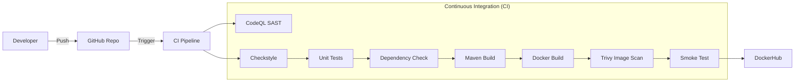

# Advanced DevOps CI/CD Project Report

**Project Title**: Secure CI/CD Pipeline for Java Spring Boot Application
**Date**: January 20, 2026

---

## 1. Problem Background & Motivation

In modern software delivery, manual deployments and lack of automated checks lead to "integration hell," security vulnerabilities, and technical debt. The motivation for this project is to construct a **production-grade Continuous Integration (CI) pipeline** that not only builds code but also proactively mitigates risks through automated quality gates and security scanning. This ensures that every code change is verified, secure, and ready for deployment, adhering to **DevSecOps** principles.

## 2. Application Overview

The target application is a "Real World" **Java Spring Boot** REST API Service using:
- **Language**: Java 21 (LTS)
- **Framework**: Spring Boot 3.4.1
- **Build Tool**: Maven
- **Containerization**: Docker

The application exposes a simple REST endpoint (`/`) and includes standard Actuator health checks, verifying runtime stability.

## 3. CI/CD Architecture Diagram

The pipeline follows a "Shift Left" approach, verifying code quality and security *before* the artifact is published.

## 4. CI/CD Pipeline Design & Stages

The pipeline is defined in `.github/workflows/ci.yml`.

| Stage | Tool | Justification (Why it matters) |
|-------|------|--------------------------------|
| **Checkout** | `actions/checkout` | Pulls the source code to the runner. |
| **Setup Runtime** | `actions/setup-java` | Configures the Java 21 environment and caches Maven dependencies for speed. |
| **SAST** | **CodeQL** | **Static Application Security Testing**. Detects code-level vulnerabilities (e.g., SQLi, XSS) without executing the code. Matches OWASP Top 10 focus. |
| **Linting** | **Checkstyle** | Enforces coding standards (Google Checks). Prevents technical debt and ensures maintainability. |
| **Unit Tests** | **JUnit 5** | Validates internal business logic. Prevents regressions in features. |
| **SCA** | **OWASP Dependency Check** | **Software Composition Analysis**. Scans `pom.xml` dependencies against National Vulnerability Database (NVD) to find known CVEs in libraries. |
| **Build** | Maven | Packages the application into an executable JAR. |
| **Docker Build** | Docker | Containers the application for consistent Deployment. |
| **Image Scan** | **Trivy** | Scans the container OS (Debian/Alpine) and layers for vulnerabilities. Ensures no vulnerable OS packages are shipped. |
| **Smoke Test** | Docker/Curl | **Runtime Validation**. Starts the container and probes the health endpoint to ensure the app actually boots up. |
| **Publish** | DockerHub | Pushes the validated, trusted image to the public registry. |

## 5. Security & Quality Controls

### Quality Gates
- **Code Style**: The build *fails* if code does not adhere to the defined checkstyle rules.
- **Test Coverage**: The pipeline runs unit tests; failure in tests stops the deployment.

### Security Gates
- **SAST**: GitHub CodeQL runs in parallel to detect logic bugs.
- **Supply Chain**: OWASP Dependency Check flags libraries with known CVEs (CVSS score > 7 fails the build).
- **Container Security**: Trivy scans for Critical/High vulnerabilities in the Docker image.

## 6. Secrets Configuration

To enable the CD portion (Push to DockerHub), the following **GitHub Repository Secrets** must be configured:

| Secret Name | Purpose |
|-------------|---------|
| `DOCKERHUB_USERNAME` | Your DockerHub username. |
| `DOCKERHUB_TOKEN` | A personal access token from DockerHub (not your password). |

## 7. Results & Observations
- **Automation**: The manual process of building, testing, and checking for vulnerabilities is now fully automated.
- **Speed**: Caching Maven dependencies significantly reduces build time.
- **Confidence**: The "Smoke Test" stage provides high confidence that the artifact is not just a valid file, but a working server.

## 8. Limitations & Improvements
- **CD Deployment**: Currently, the pipeline pushes to registry but does not deploy to a Kubernetes cluster (CD stage).
- **Test Coverage**: More comprehensive integration tests and mutation testing could be added.
- **Notification**: Slack/Email notifications on build failure could improve team responsiveness.
