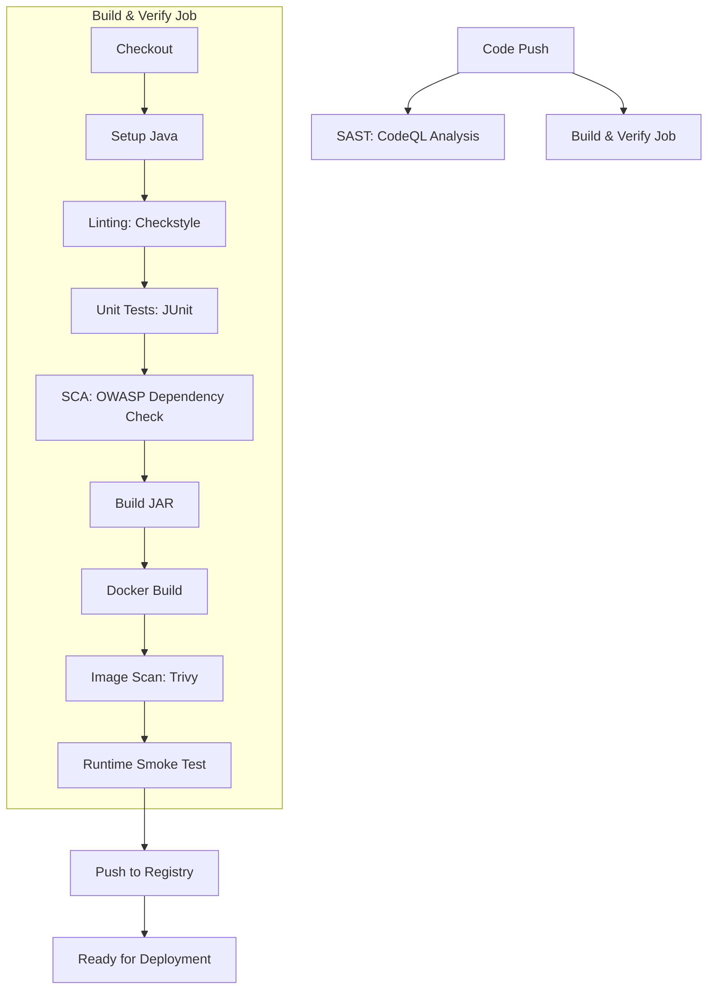

# DevOps CI/CD Project - Reference Implementation

This project tests the ability to design, implement, and reason about a real-world CI pipeline, incorporating security, quality gates, automation, and containerization.

## Project Structure
```
devops-cicd/
├── .github/workflows/    # CI/CD Pipelines
│   └── ci.yml            # Main CI Pipeline
├── devops/               # Application Source Code
│   ├── src/              # Java Source & Tests
│   ├── Dockerfile        # Container Definition
│   ├── pom.xml           # Build Configuration
│   └── checkstyle.xml    # Code Quality Rules
└── README.md             # This file
```

## Application Overview
The application is a "Real World" Spring Boot service exposing a REST API.
- **Framework**: Spring Boot 3.4.1
- **Language**: Java 21
- **Build Tool**: Maven

## CI/CD Pipeline Architecture
The pipeline is designed to enforce quality and security at every stage ("Shift Left").



### Pipeline Stages Explained

| Stage | Tool | Purpose |
|-------|------|---------|
| **SAST** | CodeQL | Detects vulnerabilites in the source code (e.g. SQL Injection) before build. |
| **Linting** | Checkstyle | Enforces coding standards (Google Checks) to prevent technical debt. |
| **Unit Tests** | JUnit 5 | Validates business logic and prevents regressions. |
| **SCA** | OWASP Dep Check | Scans third-party libraries (dependencies) for known vulnerabilities (CVEs). |
| **Container Security** | Trivy | Scans the built Docker image for OS-level vulnerabilities. |
| **Smoke Test** | Docker/Curl | Validates that the container actually starts and serves traffic. |

## How to Run Locally

### 1. Build and Run App
```bash
cd devops
./mvnw spring-boot:run
```
Access the app at `http://localhost:8080/`.

### 2. Build Docker Image
```bash
cd devops
docker build -t devops-demo .
docker run -p 8080:8080 devops-demo
```

### 3. Run Checks
- **Linting**: `./mvnw checkstyle:check`
- **Tests**: `./mvnw test`
- **Security Check**: `./mvnw dependency-check:check`

## Secrets Configuration
To enable pushing to DockerHub, configuring the following Repository Secrets in GitHub:
- `DOCKERHUB_USERNAME`
- `DOCKERHUB_TOKEN`
